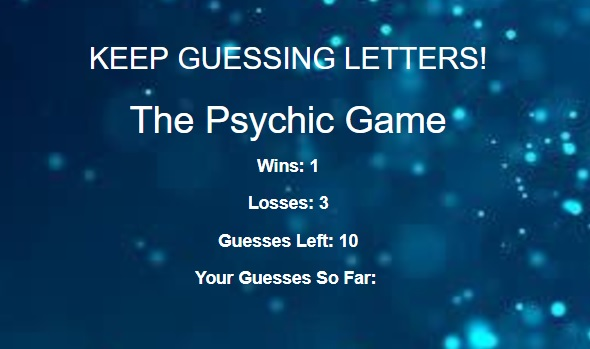

# Psychic-Game

The Psychic Game is about guessing random letters in the alphabet. The game interface is within the game tag. 

The CODE: document.querySelector("#game").innerHTML = html ----- puts the variables within the game tag. 

THE CODE: document.onkeyup = function (event) ----- initiates a function when a key is pressed

The variables include: wins, losses, guesses & used_letters